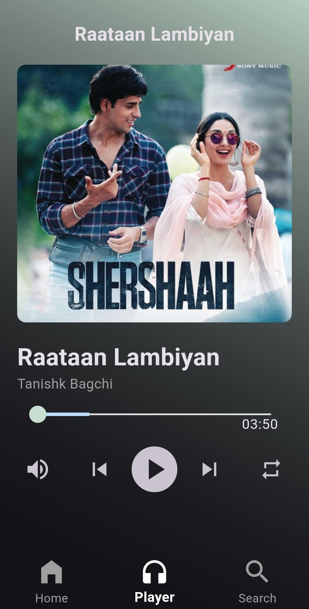

# 🎶 Rhythmix

Welcome to **Rhythmix**, a dynamic and immersive music streaming application built with Flutter using Jio Saavn Api. Rhythmix allows users to search for songs, listen to their favorite music, explore top albums, and much more.

## 📲 Download APK

**Download the latest APK of the Rhythmix app from the following link:**

[**Download Rhythmix APK**](https://drive.google.com/file/d/1zmdNhQNRonf15yXFCoyKVfSKeb8a4jwP/view?usp=sharing)

## 🌟 Features

- **🏠 Home Page**: Discover trending songs, top albums, and popular artists, all in one place.
- **🔍 Search Functionality**: Search for songs, artists, or podcasts with real-time results as you type.
- **🎵 Music Player**: Enjoy a fully functional music player with playback controls, playlists, and song queue management.
- **🎧 Genre Browsing**: Explore music by various genres and discover new favorites.
- **🎤 Artist Exploration**: Dive into the world of your favorite artists and explore their complete discography and popular tracks.
- **📊 Firebase Integration**: Real-time updates and data management using Firebase Firestore.
- **✨ Custom Shimmer Effects**: Smooth loading animations using the Shimmer package, enhancing the user experience while data is being fetched.
- **🚨 Firebase Crashlytics**: Integrated Firebase Crashlytics for real-time crash reporting and tracking app stability.
- **🎵 JioSaavn API Integration**: Access a vast collection of songs, albums, and artists using the JioSaavn API.

## 📸 Screenshots

Home             |  Player         |  Search
:-------------------------:|:-------------------------:|:-------------------------:
  |     |  


## 🚀 Installation

To run this project, follow these steps:

1. **Clone the repository**:
   ```
   git clone https://github.com/your-username/rhythmix.git
   cd rhythmix
   ```

2. **Install dependencies**:
   ```
   flutter pub get
   ```

3. **Run the app**:
   ```
   flutter run
   ```

Ensure you have Flutter installed and set up on your machine. For more details, check the [official Flutter documentation](https://flutter.dev/docs/get-started/install).

## 📂 Project Structure

```
lib/
├── models/                # Data models
├── pages/                 # Application screens/pages
├── providers/             # State management providers
├── services/              # Backend services and API calls
├── utils/                 # Utility functions and constants
├── widgets/               # Reusable UI components
└── main.dart              # Entry point of the application
```

## 📦 Dependencies

- **Provider**: For state management, providing a reactive and efficient way to handle UI updates.
- **CachedNetworkImage**: Efficient image caching and loading, improving performance and user experience.
- **Firebase & Firestore**: Used for backend services, including real-time database updates, user authentication, and data storage. Firebase Firestore is a flexible, scalable database for mobile, web, and server development.
- **Shimmer**: Used for creating custom shimmer effects to enhance the user experience during data loading states.
- **Firebase Crashlytics**: Integrated for real-time crash reporting, enabling quick identification and resolution of issues to ensure app stability.

### Firebase Setup

To set up Firebase, Firestore, and Crashlytics:

1. Go to the [Firebase Console](https://console.firebase.google.com/) and create a new project.
2. Add your Flutter app to the project.
3. Follow the setup instructions to add `google-services.json` (for Android) and `GoogleService-Info.plist` (for iOS) to your project.
4. Initialize Firebase in your `main.dart` file.

For more detailed instructions, visit the [Firebase documentation](https://firebase.google.com/docs/flutter/setup).

## 📬 Contact

For any inquiries or issues, please contact [aftabbagwan9886@gmail.com](mailto:aftabbagwan9886@gmail.com).

---